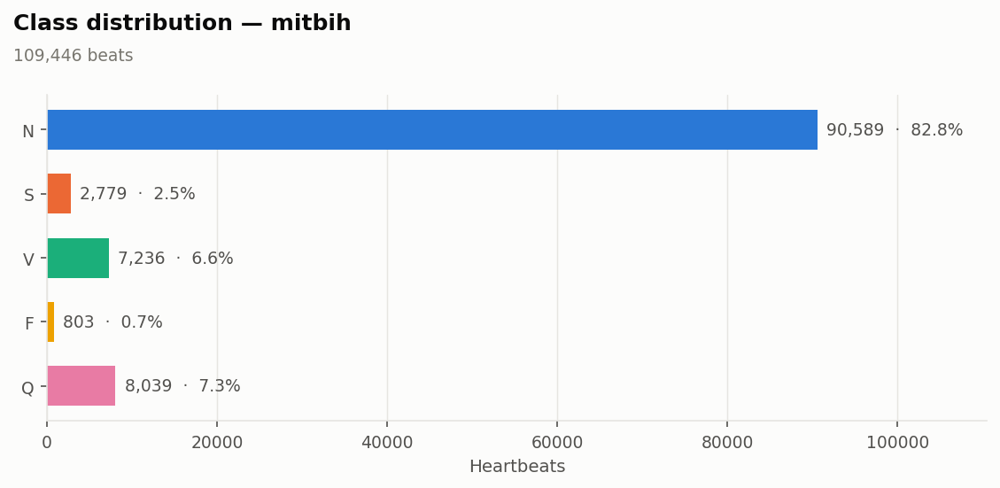
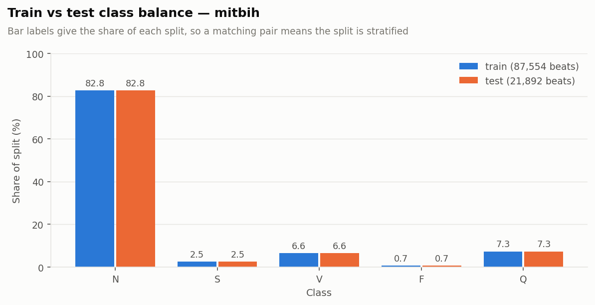
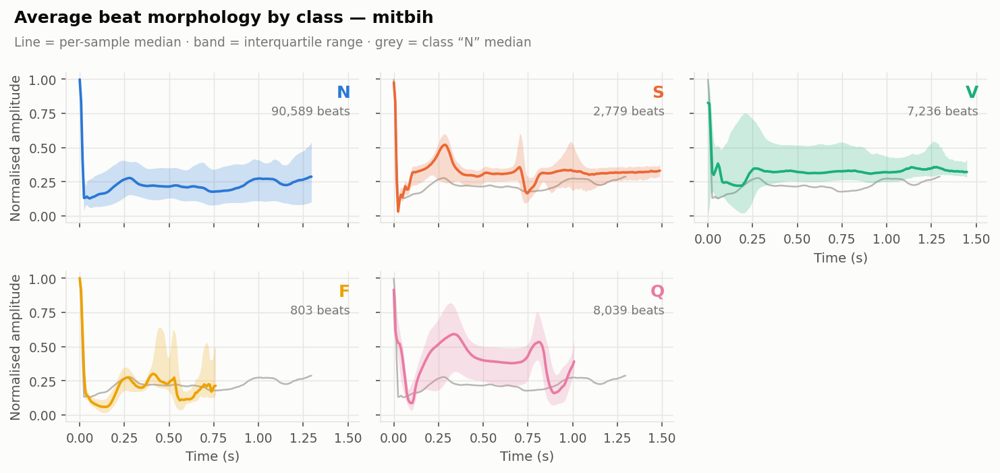
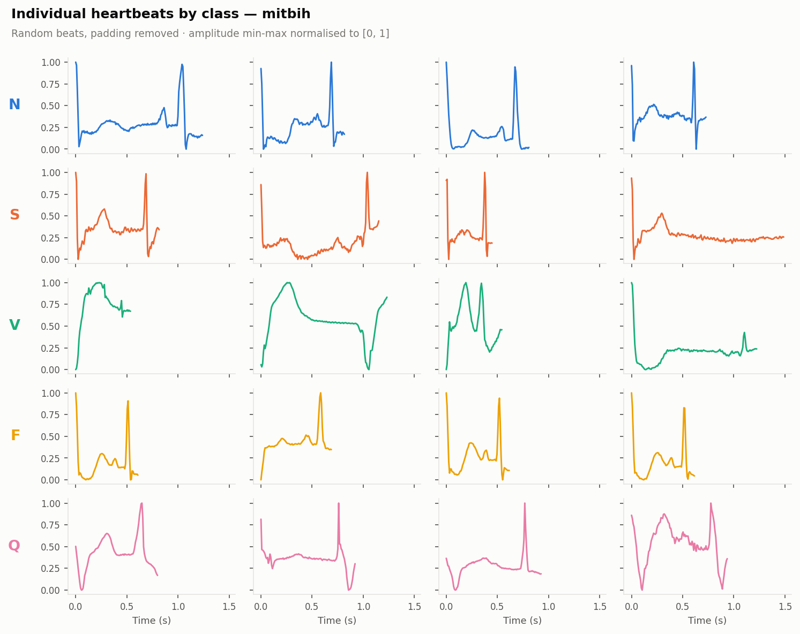
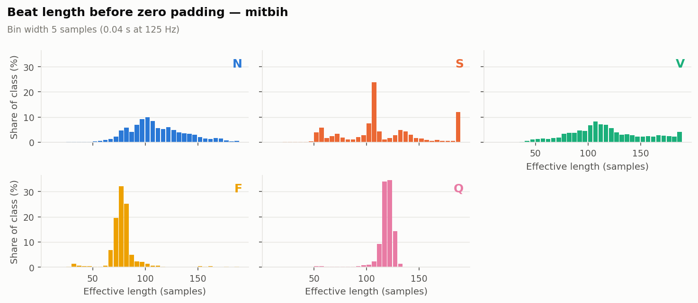
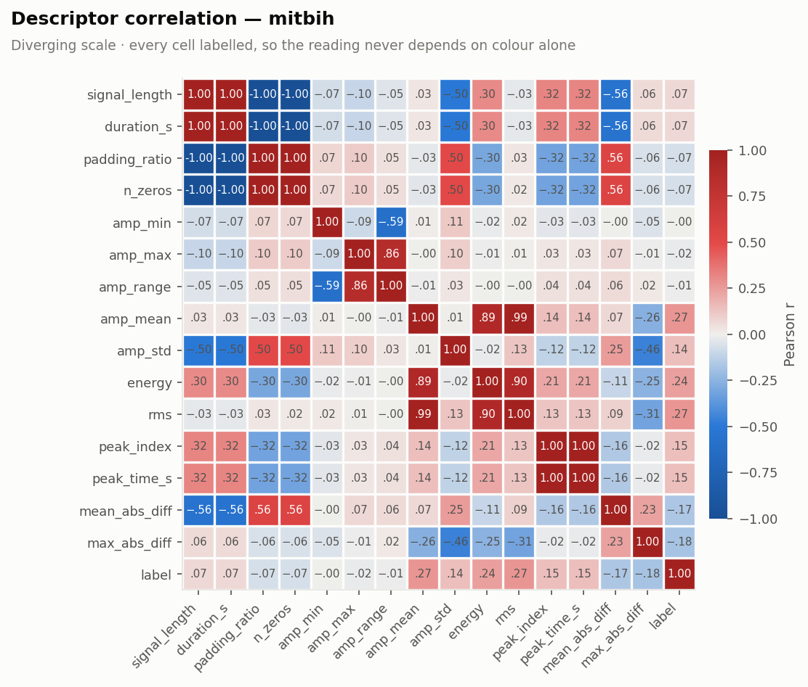
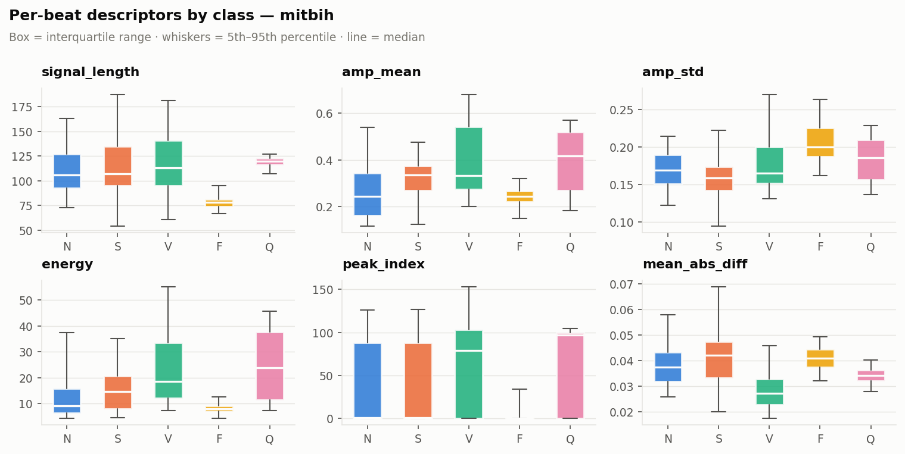

# ECG Heartbeat Categorization — PySpark ingestion, EDA & preprocessing

A Spark-native data pipeline for the [ECG Heartbeat Categorization dataset](https://www.kaggle.com/datasets/shayanfazeli/heartbeat):
123,998 segmented heartbeats from the **MIT-BIH Arrhythmia** and **PTB Diagnostic ECG**
databases, ingested from raw CSV, explored end to end, and turned into model-ready
feature vectors.

Everything is written against `pyspark` — including the descriptors, which are
computed with array higher-order functions inside the JVM rather than by Python
UDFs — so the same code runs on a laptop and on a Databricks cluster without a
single change.

**This repository covers the data phase: ingestion, exploratory analysis and
preprocessing.** Modelling is deliberately out of scope; the last section says
where it would start.

| | |
|---|---|
| **Beats** | 123,998 — 109,446 MIT-BIH (5 classes) + 14,552 PTB (2 classes) |
| **Signal** | 187 samples per beat at 125 Hz (1.50 s), min-max normalised, zero-padded |
| **Storage** | 556 MB CSV → **48 MB Parquet**, written in ~14 s |
| **Full EDA** | ~75 s on 2 cores, all aggregations distributed |
| **Output** | 194-dimensional feature vectors + a saved `PipelineModel` |
| **Tests** | 66 passing (`pytest`) |

---

## Contents

- [The dataset](#the-dataset)
- [Findings](#findings)
- [What the EDA changed downstream](#what-the-eda-changed-downstream)
- [Repository layout](#repository-layout)
- [Getting started](#getting-started)
- [Running on Databricks](#running-on-databricks)
- [Why PySpark for a dataset this size](#why-pyspark-for-a-dataset-this-size)
- [Design notes](#design-notes)
- [Roadmap](#roadmap)
- [References](#references)

---

## The dataset

Four head-less CSV files, each a matrix of 188 float columns: the first 187 are the
amplitude samples of one segmented heartbeat, the last one is the class label. The
signals were cropped to a single beat, downsampled to 125 Hz, min-max normalised to
`[0, 1]` and right-padded with zeros to a fixed length.

| Collection | File | Beats | Classes |
|---|---|---:|---|
| MIT-BIH Arrhythmia | `mitbih_train.csv` | 87,554 | N, S, V, F, Q |
| MIT-BIH Arrhythmia | `mitbih_test.csv` | 21,892 | N, S, V, F, Q |
| PTB Diagnostic ECG | `ptbdb_normal.csv` | 4,046 | normal |
| PTB Diagnostic ECG | `ptbdb_abnormal.csv` | 10,506 | abnormal |

MIT-BIH classes follow the AAMI grouping: **N** normal, **S** supraventricular
ectopic, **V** ventricular ectopic, **F** fusion, **Q** unknown/paced. PTB is a
binary healthy-control vs myocardial-infarction split.

---

## Findings

### 1 · The imbalance is the defining property of MIT-BIH



Normal beats hold **82.8%** of the collection; fusion beats hold **0.73%** — a
**113:1 ratio**. Accuracy is meaningless here: answering "N" to everything already
scores 82.8%. Macro-F1 and the per-class recall of `S` and `F` are the metrics that
separate models.

PTB is far milder at **2.6:1**, and inverted — the pathological class is the
majority one, because the database was assembled around infarction cases.



The published MIT-BIH split is already stratified: every class share matches
between train and test to within 0.02 points. The test split can be used as
published.

### 2 · The data is clean — with two footnotes

No nulls, no NaNs, no wrong-length rows, no amplitude outside `[0, 1]`, and in
MIT-BIH **109,446 beats with 109,446 distinct waveforms** — not one exact
duplicate, no conflicting labels, no train/test leakage. There is nothing to clean.

Two anomalies are worth recording:

- **225 MIT-BIH beats (0.21%) peak below 1.0**, some as low as 0.61, and 83 (0.08%)
  never reach 0.0 — impossible if each beat were min-max normalised in isolation.
  **179 of the 225 are class `S`**: 6.4% of that class against 0.04% of class `N`.
  The pattern fits a segmentation window clipping the R peak of beats that arrive
  early — which is exactly what makes a beat supraventricular. Amplitude features
  on class `S` may therefore be reading a segmentation artefact, not physiology.
- **PTB contains 7 duplicated waveforms (0.05%)**, none with conflicting labels.
  Harmless in itself, but PTB ships no train/test split — so deduplicate before
  splitting, or the same waveform lands on both sides of it.

### 3 · Class morphology is visibly distinct



Median waveform per class, with the interquartile band, computed over 20 M exploded
`(beat, sample)` pairs. The shapes match the clinical definitions: `V` is wide and
slow with no sharp QRS complex, `Q` carries a large late secondary deflection, `F`
is markedly shorter than everything else, and `S` sits closest to `N` — which is
why it is the hardest class to separate. Every beat starts at amplitude 1.0: the
segmentation is R-peak aligned by construction.



### 4 · A third to a half of every input vector is padding



| Class | Median real length | Duration | Beats with no padding |
|---|---:|---:|---:|
| F | 78 samples | 0.62 s | 0.1% |
| N | 106 | 0.85 s | 0.4% |
| S | 107 | 0.86 s | 11.7% |
| V | 113 | 0.90 s | 3.5% |
| Q | 120 | 0.96 s | 0.0% |

Two consequences. Amplitude statistics have to be computed over the unpadded
prefix, or the zeros drag every mean toward zero and short classes look
artificially flat. And effective length is itself informative — `F` is a full
0.3 s shorter than `Q` — so it is kept as a model feature.

The histograms also show discrete spikes (24% of class `S` in a single 5-sample
bin, 11.7% of `S` not padded at all): a fingerprint of the fixed cropping window
rather than of physiology.

In PTB, normal beats run **18 samples longer** than abnormal ones (130 vs 113).
Since each segment spans one cardiac cycle, that is a heart-rate difference — real
signal, but also a shortcut a classifier could take instead of reading the ST
segment.

### 5 · No scalar descriptor separates the classes



Fifteen per-beat descriptors were computed and cross-correlated. Two results:

- **Redundancy.** `duration_s`, `padding_ratio` and `n_zeros` are perfectly
  collinear with `signal_length` (|r| = 1.00); `rms` tracks `amp_mean` at r = 0.99;
  `amp_max` is constant at 1.0 for 99.8% of beats. Fifteen descriptors are really
  about seven.
- **Weak separability.** The strongest linear relationship with the label is
  **r = 0.272** (`rms`), and the per-class interquartile ranges overlap heavily for
  every descriptor. Whatever separates these classes lives in the *shape* of the
  waveform, not in its scalar summaries.



That is the empirical case for feeding a model the full 187-sample vector and
treating the descriptors as a small side channel — which is what the preprocessing
pipeline does.

---

## What the EDA changed downstream

| Observation | Decision in `04_preprocessing` |
|---|---|
| 113:1 class imbalance | Balanced class weights by default (`weightCol="class_weight"`); resampling available but confined to the training split |
| Published split already stratified | Test split kept as published; validation carved out of train, stratified by `percent_rank` rather than `randomSplit` |
| PTB ships no split | Reproducible stratified 70/15/15 |
| No nulls, duplicates or leakage | No cleaning stage at all |
| 33–50% padding per vector | Descriptors computed on the unpadded prefix; `signal_length` kept as a feature |
| Descriptors collinear, weakly linked to the label | Pruned 15 → 7; the 187-sample waveform stays the primary input |

Final feature vector: **194 dimensions** = 187 waveform samples ⊕ 7 descriptors,
standard-scaled with the scaler fit **on the training split only**.

---

## Repository layout

```
ECG-Heartbeat-Categorization/
├── conf/
│   └── config.yaml                 Paths, Spark tuning, analysis parameters
├── notebooks/
│   ├── 01_ingestion.ipynb          CSV → canonical Spark DataFrame → Parquet
│   ├── 02_eda_mitbih.ipynb         Full EDA of the arrhythmia collection
│   ├── 03_eda_ptbdb.ipynb          EDA of PTB + cross-collection comparison
│   └── 04_preprocessing.ipynb      Splits, weights, Spark ML pipeline
├── reports/
│   ├── figures/                    13 generated figures
│   └── tables/                     18 summary tables (CSV)
├── scripts/
│   ├── ingest_raw.py               CLI: raw CSV → Parquet
│   ├── run_eda.py                  CLI: every table and figure
│   └── build_features.py           CLI: model-ready datasets + saved pipeline
├── src/ecg/
│   ├── config.py                   Layered configuration (YAML → env → kwargs)
│   ├── session.py                  SparkSession builder, local and Databricks
│   ├── schema.py                   Raw and canonical schemas, label metadata
│   ├── ingest.py                   Parsing, canonicalisation, Parquet I/O
│   ├── features.py                 Per-beat descriptors as Spark Columns
│   ├── eda.py                      Distributed aggregations → pandas summaries
│   ├── preprocessing.py            Spark ML pipeline, splits, class balancing
│   └── viz.py                      Matplotlib rendering of those summaries
└── tests/                          66 tests, real Spark session
```

The notebooks are committed **with their outputs**, so the analysis reads on GitHub
without running anything.

---

## Getting started

### Requirements

- Python 3.9+
- A JVM on `PATH` — Java 11 or 17 for PySpark 3.5, Java 17+ for PySpark 4
  (`java -version` must work)
- ~2 GB free RAM for the default local session

### Install

```bash
git clone https://github.com/LunaPerezT/ECG-Heartbeat-Categorization.git
cd ECG-Heartbeat-Categorization

python -m venv .venv
source .venv/bin/activate        # Windows: .venv\Scripts\activate

pip install -e ".[dev]"          # or: pip install -r requirements.txt
```

### Data

The four CSVs are **not** in this repository — 556 MB has no business in a git
working tree. Download them from
[Kaggle](https://www.kaggle.com/datasets/shayanfazeli/heartbeat) and put them in a
`data/` folder **next to** the repository:

```
ECG Heartbeat Categorization Project/
├── data/                            <- the four CSVs go here
│   ├── mitbih_train.csv
│   ├── mitbih_test.csv
│   ├── ptbdb_normal.csv
│   └── ptbdb_abnormal.csv
└── ECG-Heartbeat-Categorization/    <- this repository
```

Anywhere else works too — point `ECG_DATA_DIR` at it, or set `data_dir` in
`conf/config.yaml`. `data/raw/` inside the repository is also detected.

### Run

```bash
python scripts/ingest_raw.py            # CSV → Parquet          (~15 s)
python scripts/run_eda.py               # every table & figure   (~75 s)
python scripts/build_features.py        # model-ready datasets   (~90 s)

pytest                                  # 66 tests
jupyter lab notebooks/                  # or read them on GitHub
```

Every script takes `--data-dir`, `--shuffle-partitions` and `--driver-memory`;
`run_eda.py` and `build_features.py` also take `--source mitbih|ptbdb|both`.

### Windows note

PySpark on Windows needs the Hadoop native shims to **write** files locally.
Without them the CSV reads work but the first Parquet write fails with
`UnsatisfiedLinkError: org.apache.hadoop.io.nativeio.NativeIO$Windows.access0`.

Fix it once:

1. Download `winutils.exe` and `hadoop.dll` for a Hadoop 3.x build (e.g.
   [cdarlint/winutils](https://github.com/cdarlint/winutils)).
2. Put both in `C:\hadoop\bin`.
3. Set `HADOOP_HOME=C:\hadoop` and add `%HADOOP_HOME%\bin` to `PATH`.
4. If the error persists, copy `hadoop.dll` into `C:\Windows\System32` as well.

Running under WSL2 avoids the whole issue.

---

## Running on Databricks

The code is written to run unchanged on a cluster:

- `get_spark()` detects `DATABRICKS_RUNTIME_VERSION` and attaches to the cluster's
  existing session instead of building one, so master, memory and parallelism stay
  under the cluster's control.
- `stop_spark()` is a no-op there — a notebook cannot be allowed to kill the
  cluster session.
- Nothing depends on the local filesystem: point `ECG_DATA_DIR` at a DBFS or
  Unity Catalog volume path (`/dbfs/...`, `/Volumes/...`) and every read and write
  follows.
- The pipeline contains no Python UDFs, so there is no serialisation boundary to
  slow it down on a real cluster.

Clone the repo into Databricks Repos, `%pip install -e .` in the first cell, and
run the notebooks in order.

---

## Why PySpark for a dataset this size

Worth stating plainly, because it is a fair question. **109,446 × 187 float32
values is about 82 MB** — it fits in the RAM of any laptop, and pandas would run
this analysis faster than Spark does, without a JVM.

Spark is used here anyway, for reasons that are about the shape of the code rather
than the size of this particular file:

- **The pipeline is the deliverable, not the numbers.** Ingestion, descriptors,
  aggregations and preprocessing are written so that the same code handles the full
  PhysioNet archives, or a hospital's own recordings, without a rewrite. The volume
  changes; the code does not.
- **Everything stays in the JVM.** The descriptors are Spark `Column` expressions
  built from `transform`/`aggregate`/`filter`/`zip_with`, not Python UDFs, so
  there is no per-row Python round trip and the work parallelises properly.
- **The preprocessing is a real `pyspark.ml.Pipeline`** — including two custom
  transformers — so the fitted model is savable, reloadable and versionable
  alongside the data it produced.
- **Databricks is a first-class target**, and the session handling reflects that.

And the honest counterpoint: at this scale Spark costs a JVM, a few seconds of
session startup and some ceremony that pandas would not charge. If the goal were
purely the fastest path to these figures, pandas would be the right tool. If the
goal is a pipeline that survives contact with more data, this is.

---

## Design notes

A few decisions that are not obvious from the file listing.

**Explicit schema, never `inferSchema`.** Inference would cost a full extra pass
over 556 MB of text to rediscover a layout the dataset authors documented.

**One `array<double>` instead of 187 columns.** It makes the analysis expressible
with array higher-order functions, and it is what lets Parquet compress the data
11.5×.

**Descriptors computed on the unpadded prefix.** `effective_length` finds the last
non-zero sample, and every amplitude statistic slices to it first. The one known
edge case — a beat whose real final sample happens to be exactly 0.0 — is measured
and reported as `pct_ambiguous_tail`, not hidden.

**`percent_rank` splits, not `randomSplit`.** With class `F` at 0.73% of the data,
an unstratified 15% slice can easily land 20% away from the true proportion.
Ranking each class independently by a seeded random order and cutting at
percentiles gives exact proportions *and* reproducibility.

**Scaler fit on the training split only.** Fitting on the full frame would push
validation and test statistics into the features — a leak that quietly inflates
every downstream score.

**Boxplots drawn from Spark-computed percentiles.** `Axes.bxp` is fed
`percentile_approx` results, so the figures never require collecting raw beats to
the driver.

**Figures follow one visual system.** A fixed class→hue assignment validated for
colour-vision deficiency, small multiples instead of five overlapping lines, and a
visible label on every categorical mark so identity never depends on colour alone.

---

## Roadmap

The natural continuation, in order:

1. **Spark ML baseline** — logistic regression and random forest on the 194-dim
   vectors with `weightCol="class_weight"`, scored by macro-F1 and per-class
   recall. Establishes the floor.
2. **1-D CNN on the raw waveform** — where the source paper's results come from,
   and where section 5 above says the signal actually lives.
3. **MIT-BIH → PTB transfer** — freeze the representation learned on 109k
   arrhythmia beats, fine-tune on the 14.5k PTB beats. The two collections share
   format, sampling rate and normalisation, and their aggregate statistics land
   within 6 samples and 0.004 amplitude units of each other, which is what makes
   the transfer plausible.
4. **Evaluation that respects the imbalance** — confusion matrices, per-class
   precision/recall curves, and a check that the PTB model is not simply measuring
   heart rate.

---

## References

> Mohammad Kachuee, Shayan Fazeli, and Majid Sarrafzadeh.
> *ECG Heartbeat Classification: A Deep Transferable Representation.*
> [arXiv:1805.00794](https://arxiv.org/abs/1805.00794) (2018).

- Dataset: [ECG Heartbeat Categorization Dataset](https://www.kaggle.com/datasets/shayanfazeli/heartbeat) (Kaggle)
- [MIT-BIH Arrhythmia Database](https://www.physionet.org/physiobank/database/mitdb/) (PhysioNet)
- [PTB Diagnostic ECG Database](https://www.physionet.org/physiobank/database/ptbdb/) (PhysioNet)

Released under the [MIT License](LICENSE).
