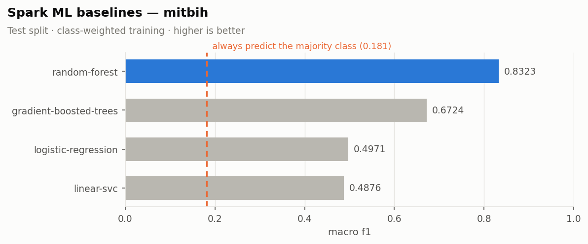
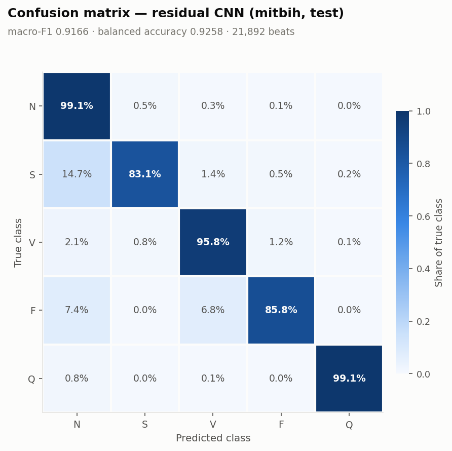
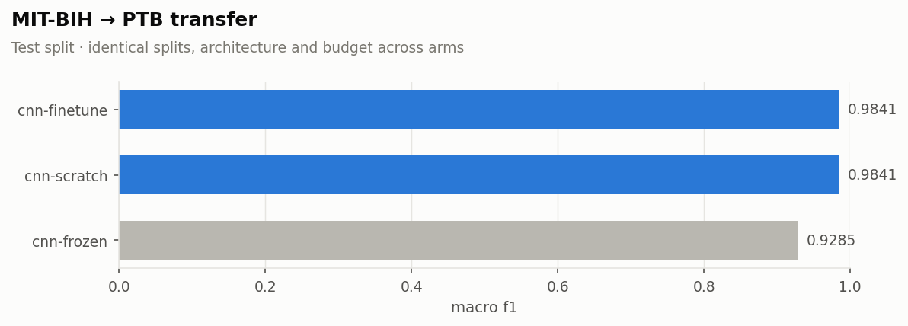
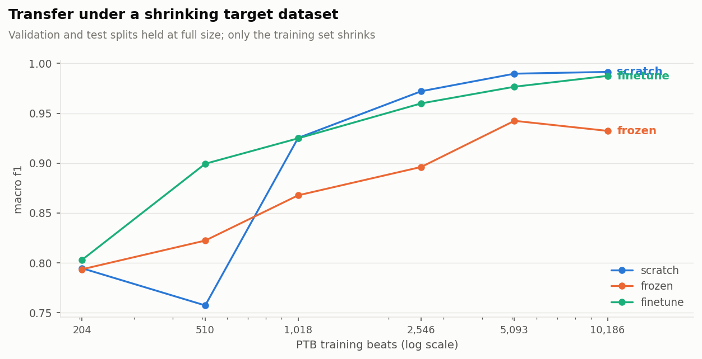

# ECG Heartbeat Categorization — PySpark data pipeline, Spark ML baselines and a 1-D CNN

An end-to-end study of the [ECG Heartbeat Categorization dataset](https://www.kaggle.com/datasets/shayanfazeli/heartbeat):
123,998 segmented heartbeats from the **MIT-BIH Arrhythmia** and **PTB Diagnostic
ECG** databases, taken from raw CSV to a Spark-native data pipeline, then to
classical Spark ML baselines, a residual 1-D convolutional network, and a
controlled test of whether the learned representation transfers between the two
collections.

The data stage is written entirely against `pyspark` — the per-beat descriptors are
Spark array expressions evaluated inside the JVM, not Python UDFs — so it runs
unchanged on a laptop and on Databricks. The deep model is PyTorch, wired to Spark
through the same split assignment the baselines use, so every model in the
comparison table sees exactly the same beats.

| | |
|---|---|
| **Beats** | 123,998 — 109,446 MIT-BIH (5 classes) + 14,552 PTB (2 classes) |
| **Signal** | 187 samples per beat at 125 Hz (1.50 s), min-max normalised, zero-padded |
| **Storage** | 556 MB CSV → **48 MB Parquet**, written in ~14 s |
| **Best MIT-BIH model** | Residual 1-D CNN, **macro-F1 0.917** (best baseline: 0.832) |
| **Best PTB model** | Residual 1-D CNN, **macro-F1 0.985** (mean of 3 seeds) |
| **Compute** | Everything on **2 CPU cores, no GPU** — the CNN trains in 24 min |
| **Tests** | 109 passing (`pytest`) |

---

## Contents

- [Results](#results)
- [The dataset](#the-dataset)
- [What the data says](#what-the-data-says)
- [How the EDA shaped the models](#how-the-eda-shaped-the-models)
- [Repository layout](#repository-layout)
- [Getting started](#getting-started)
- [Running on Databricks](#running-on-databricks)
- [Why PySpark for a dataset this size](#why-pyspark-for-a-dataset-this-size)
- [Design notes](#design-notes)
- [Roadmap](#roadmap)
- [References](#references)

---

## Results

Every model below was trained on the same splits, scored on the same untouched
test split, and ranked by **macro-averaged F1**. Accuracy is reported but never
ranked on, for the reason the first table makes obvious.

### MIT-BIH — five classes, 21,892 test beats

| Model | macro-F1 | Balanced acc. | Accuracy | Fit time |
|---|---:|---:|---:|---:|
| **Residual 1-D CNN** (PyTorch) | **0.9166** | 0.9258 | 0.9840 | 24 min |
| Random forest (Spark ML) | 0.8323 | 0.8654 | 0.9668 | 112 s |
| Gradient-boosted trees (Spark ML) | 0.6724 | 0.8870 | 0.8775 | 117 s |
| Logistic regression (Spark ML) | 0.4971 | 0.7869 | 0.6834 | 30 s |
| Linear SVM (Spark ML) | 0.4876 | 0.7908 | 0.6623 | 72 s |
| *Always predict `N`* | *0.1811* | *0.2000* | *0.8276* | — |



**The trivial model scores 82.8% accuracy and macro-F1 0.181.** It never predicts
a ventricular or fusion beat — the ones a cardiologist needs flagged. That gap is
why this project ranks on macro-F1 throughout.

**The CNN's gain is concentrated in the rare classes**, which is exactly where it
matters:

| Class | Beats (test) | CNN F1 | CNN recall |
|---|---:|---:|---:|
| N — normal | 18,118 | 0.9919 | 0.9913 |
| S — supraventricular | 556 | 0.8309 | 0.8309 |
| V — ventricular | 1,448 | 0.9559 | 0.9579 |
| F — fusion | 162 | 0.8129 | 0.8580 |
| Q — paced / unknown | 1,608 | 0.9916 | 0.9907 |



The residual CNN reads the **raw 187-sample waveform**; the Spark baselines read a
194-dimensional vector of the same waveform plus seven engineered descriptors. The
CNN wins by 8.4 points of macro-F1 with *less* feature engineering, which is the
empirical answer to the EDA's finding that no scalar descriptor correlates with
the label above r = 0.27.

### PTB Diagnostic — myocardial infarction, 2,183 test beats

| Model | macro-F1 | Balanced acc. | Accuracy |
|---|---:|---:|---:|
| **CNN, trained from scratch** | **0.9841** | 0.9850 | 0.9872 |
| **CNN, fine-tuned from MIT-BIH** | **0.9841** | 0.9866 | 0.9872 |
| Random forest (Spark ML) | 0.9361 | 0.9483 | 0.9473 |
| CNN, frozen MIT-BIH backbone | 0.9285 | 0.9451 | 0.9404 |
| Gradient-boosted trees (Spark ML) | 0.9119 | 0.9366 | 0.9253 |
| Linear SVM (Spark ML) | 0.8102 | 0.8520 | 0.8310 |
| Logistic regression (Spark ML) | 0.8057 | 0.8501 | 0.8259 |
| *Always predict `abnormal`* | *0.4193* | *0.5000* | *0.7219* |

The three CNN rows are one run each; the next section repeats them across seeds,
which is what the ranking should actually be read from.

### Does the representation transfer?

The source paper's headline claim is that a representation learned on the 109k
arrhythmia beats transfers to infarction detection. Three arms were run on
identical PTB splits — from scratch, frozen backbone, and full fine-tune — because
without the from-scratch control a good fine-tuning score says nothing about
transfer, only that the architecture suits the task.



A single run turned out not to be enough to rank the arms. Two "identical" runs of
the same arm landed more than a point apart — convolution backward passes on CPU
are not bit-deterministic across threads, and over 40+ epochs that compounds into a
different early-stopping point. So every arm was repeated across three seeds:

| Arm | macro-F1 (mean ± sd) | Range over 3 seeds | Δ vs scratch | Trainable params |
|---|---:|---|---:|---:|
| From scratch | **0.9854 ± 0.0017** | 0.9835 – 0.9869 | — | 53,858 |
| Fine-tuned | **0.9835 ± 0.0040** | 0.9807 – 0.9881 | −0.0019 | 53,858 |
| Frozen backbone | 0.9339 ± 0.0074 | 0.9272 – 0.9418 | **−0.0515** | 2,146 |

**At full PTB size, fine-tuning neither helps nor hurts** — its range overlaps the
from-scratch range, and the 0.002 gap is a fifth of the spread within either arm.
**Freezing the backbone does hurt**, consistently: −5.2 points with no overlap
between the two ranges.

That is a more careful claim than the single-run comparison supported, and it does
**not** mean the MIT-BIH representation is useless. The frozen arm trains **2,146
parameters** — a classifier head on features it may not change — and still reaches
macro-F1 0.934 on a task those features were never optimised for. What it means is
that **PTB is not in the low-data regime**: 10,186 training beats is enough for a
54k-parameter network to learn ST-segment-specific filters, and those beat filters
tuned to separate ventricular from supraventricular rhythm.

Transfer learning is a claim about what happens when the target data *is* scarce,
so the honest test is to take the data away. `scripts/run_low_data.py` reruns all
three arms while subsampling the PTB training split — stratified, so the class
prior never moves — with validation and test held at full size.



**Finding — transfer pays exactly where it is supposed to, and nowhere else.**

| PTB training beats | from scratch | frozen | fine-tuned | fine-tuned − scratch |
|---:|---:|---:|---:|---:|
| 204 | 0.7944 | 0.7934 | 0.8029 | +0.009 |
| 510 | 0.7571 | 0.8222 | **0.8993** | **+0.142** |
| 1,018 | 0.9252 | 0.8676 | 0.9248 | −0.000 |
| 2,546 | 0.9721 | 0.8961 | 0.9599 | −0.012 |
| 5,093 | 0.9897 | 0.9424 | 0.9766 | −0.013 |
| 10,186 | 0.9915 | 0.9323 | 0.9875 | −0.004 |

At **510 training beats — 5% of PTB — fine-tuning from MIT-BIH is worth 14 points
of macro-F1**, and even the frozen backbone is worth 6.5. The advantage closes by
about 1,000 beats and inverts beyond it. The paper's claim and the full-size result
above are therefore not in conflict: they are the same curve read at two different
points on the x-axis.

Two caveats, stated rather than buried. Each cell is a **single run**, so individual
points carry seed noise — visible in the from-scratch arm scoring *lower* at 510
beats than at 204, and quantified by the ±0.002–0.007 spreads in the table above. And this sweep uses its own budget (batch 64, 40 epochs) rather
than the full-size settings, so its 100% column is not directly comparable with the
table above.

---

## The dataset

Four head-less CSV files, each a matrix of 188 float columns: the first 187 are the
amplitude samples of one segmented heartbeat, the last one is the class label. The
signals were cropped to a single beat, downsampled to 125 Hz, min-max normalised to
`[0, 1]` and right-padded with zeros to a fixed length.

| Collection | File | Beats | Classes |
|---|---|---:|---|
| MIT-BIH Arrhythmia | `mitbih_train.csv` | 87,554 | N, S, V, F, Q |
| MIT-BIH Arrhythmia | `mitbih_test.csv` | 21,892 | N, S, V, F, Q |
| PTB Diagnostic ECG | `ptbdb_normal.csv` | 4,046 | normal |
| PTB Diagnostic ECG | `ptbdb_abnormal.csv` | 10,506 | abnormal |

MIT-BIH classes follow the AAMI grouping: **N** normal, **S** supraventricular
ectopic, **V** ventricular ectopic, **F** fusion, **Q** unknown/paced. PTB is a
binary healthy-control vs myocardial-infarction split.

---

## What the data says

Full analysis in [`notebooks/02_eda_mitbih.ipynb`](notebooks/02_eda_mitbih.ipynb)
and [`notebooks/03_eda_ptbdb.ipynb`](notebooks/03_eda_ptbdb.ipynb). The five
findings that changed what came after:

### 1 · The imbalance is the defining property of MIT-BIH


Normal beats hold **82.8%**; fusion beats hold **0.73%** — a **113:1 ratio**. The
published train/test split is already stratified to within 0.02 points, so it is
used as published.

### 2 · The data is clean — with two footnotes

No nulls, no NaNs, no amplitude outside `[0, 1]`, and in MIT-BIH **109,446 beats
with 109,446 distinct waveforms** — no exact duplicates, no conflicting labels, no
train/test leakage.

Two anomalies worth recording: **225 MIT-BIH beats (0.21%) peak below 1.0** despite
per-beat min-max normalisation, **179 of them class `S`** (6.4% of that class
against 0.04% of `N`) — consistent with the segmentation window clipping the R peak
of beats that arrive early, which is what makes a beat supraventricular. And PTB
holds **7 duplicated waveforms**, harmless in themselves but a split hazard, since
PTB ships no train/test split of its own.

### 3 · Class morphology is visibly distinct


`V` is wide and slow with no sharp QRS complex, `Q` carries a large late secondary
deflection, `F` is markedly shorter, and `S` sits closest to `N` — which is why it
stays the hardest class for every model in this repository.

### 4 · A third to a half of every input vector is padding

Median real length runs from **78 samples (0.62 s) for `F`** to **120 (0.96 s) for
`Q`**. Amplitude statistics are therefore computed over the unpadded prefix, and
effective length is kept as a model feature.

### 5 · No scalar descriptor separates the classes


Fifteen per-beat descriptors were computed. `duration_s`, `padding_ratio` and
`n_zeros` are perfectly collinear with `signal_length`; `rms` tracks `amp_mean` at
r = 0.99. And the strongest linear relationship with the label is **r = 0.272**.
Whatever separates these classes lives in the *shape* of the waveform — which the
CNN result above confirms.

---

## How the EDA shaped the models

| Observation | Decision |
|---|---|
| 113:1 class imbalance | Balanced class weights everywhere (`weightCol` in Spark, `CrossEntropyLoss(weight=…)` in PyTorch); resampling offered but confined to the training split |
| Accuracy is misleading here | Macro-F1 is the ranking metric, the selection metric for checkpoints, and the early-stopping criterion |
| Published split already stratified | Test split kept as published; validation carved out of train with `percent_rank`, not `randomSplit` |
| PTB ships no split | Reproducible stratified 70/15/15 |
| 33–50% padding per vector | Descriptors computed on the unpadded prefix; `signal_length` kept as a feature |
| Descriptors collinear, weakly linked to the label | Pruned 15 → 7 for the Spark models; the CNN is given the raw waveform instead |

---

## Repository layout

```
ECG-Heartbeat-Categorization/
├── conf/config.yaml                Paths, Spark tuning, training hyper-parameters
├── notebooks/
│   ├── 01_ingestion.ipynb          CSV → canonical Spark DataFrame → Parquet
│   ├── 02_eda_mitbih.ipynb         Full EDA of the arrhythmia collection
│   ├── 03_eda_ptbdb.ipynb          EDA of PTB + cross-collection comparison
│   ├── 04_preprocessing.ipynb      Splits, class weights, Spark ML pipeline
│   ├── 05_baselines_spark_ml.ipynb Four classical baselines and the trivial floor
│   ├── 06_cnn_pytorch.ipynb        Residual 1-D CNN, ablation, error analysis
│   └── 07_transfer_learning.ipynb  MIT-BIH → PTB, three arms + low-data sweep
├── reports/
│   ├── figures/                    Generated figures
│   └── tables/                     Generated summary tables (CSV/JSON)
├── scripts/
│   ├── ingest_raw.py               Raw CSV → Parquet
│   ├── run_eda.py                  Every EDA table and figure
│   ├── build_features.py           Model-ready datasets + saved pipeline
│   ├── train_baselines.py          Spark ML baselines
│   ├── train_cnn.py                Residual CNN (`--distributed` for Databricks)
│   ├── run_transfer.py             The three transfer arms
│   └── run_low_data.py             Transfer as the target dataset shrinks
├── src/ecg/
│   ├── config.py                   Layered configuration (YAML → env → kwargs)
│   ├── session.py                  SparkSession builder, local and Databricks
│   ├── schema.py                   Raw and canonical schemas, label metadata
│   ├── ingest.py                   Parsing, canonicalisation, Parquet I/O
│   ├── features.py                 Per-beat descriptors as Spark Columns
│   ├── eda.py                      Distributed aggregations → pandas summaries
│   ├── preprocessing.py            Spark ML pipeline, splits, class balancing
│   ├── baselines.py                Spark ML estimators, fitting, persistence
│   ├── models.py                   Residual 1-D CNN (PyTorch)
│   ├── torch_data.py               Parquet → tensors, class weights, subsampling
│   ├── training.py                 Training loop, checkpoints, MLflow, TorchDistributor
│   ├── transfer.py                 Transfer arms and the low-data sweep
│   ├── metrics.py                  Shared evaluation for both model families
│   ├── reporting.py                Tables and figures under reports/
│   └── viz.py                      Matplotlib rendering, one visual system
└── tests/                          109 tests, real Spark session
```

The notebooks are committed **with their outputs**, so the whole study reads on
GitHub without running anything.

---

## Getting started

### Requirements

- Python 3.9+
- A JVM on `PATH` — Java 11 or 17 for PySpark 3.5, Java 17+ for PySpark 4
- ~2 GB free RAM for the default local session; no GPU needed

### Install

```bash
git clone https://github.com/LunaPerezT/ECG-Heartbeat-Categorization.git
cd ECG-Heartbeat-Categorization

python -m venv .venv
source .venv/bin/activate        # Windows: .venv\Scripts\activate

pip install -e ".[all]"          # or ".[dev]" for the data stage only, without torch
```

### Data

The four CSVs are **not** in this repository — 556 MB has no business in a git
working tree. Download them from
[Kaggle](https://www.kaggle.com/datasets/shayanfazeli/heartbeat) and put them in a
`data/` folder **next to** the repository:

```
ECG Heartbeat Categorization Project/
├── data/                            <- the four CSVs go here
│   ├── mitbih_train.csv
│   ├── mitbih_test.csv
│   ├── ptbdb_normal.csv
│   └── ptbdb_abnormal.csv
└── ECG-Heartbeat-Categorization/    <- this repository
```

Anywhere else works too — point `ECG_DATA_DIR` at it, or set `data_dir` in
`conf/config.yaml`. `data/raw/` inside the repository is also detected.

### Run

```bash
python scripts/ingest_raw.py            # CSV → Parquet             (~15 s)
python scripts/run_eda.py               # every EDA table & figure  (~75 s)
python scripts/build_features.py        # model-ready datasets      (~90 s)

python scripts/train_baselines.py       # four Spark ML baselines   (~7 min)
python scripts/train_cnn.py             # residual CNN, MIT-BIH     (~24 min, CPU)
python scripts/run_transfer.py          # three transfer arms       (~5 min)
python scripts/run_low_data.py          # low-data transfer sweep   (~20 min)

pytest                                  # 109 tests
jupyter lab notebooks/                  # or read them on GitHub
```

Timings are for **2 CPU cores with no GPU**; a laptop with more cores is faster.
Every script takes `--data-dir`, and the training scripts take `--max-epochs`,
`--batch-size`, `--learning-rate` and `--threads`.

Experiments are logged to MLflow (SQLite backend under `<data_dir>/mlruns`, so
nothing lands in the git tree). Browse them with:

```bash
mlflow ui --backend-store-uri sqlite:///../data/mlruns/mlflow.db
```

### Windows note

PySpark on Windows needs the Hadoop native shims to **write** files locally.
Without them the CSV reads work but the first Parquet write fails with
`UnsatisfiedLinkError: org.apache.hadoop.io.nativeio.NativeIO$Windows.access0`.

Fix it once:

1. Download `winutils.exe` and `hadoop.dll` for a Hadoop 3.x build (e.g.
   [cdarlint/winutils](https://github.com/cdarlint/winutils)).
2. Put both in `C:\hadoop\bin`.
3. Set `HADOOP_HOME=C:\hadoop` and add `%HADOOP_HOME%\bin` to `PATH`.
4. If the error persists, copy `hadoop.dll` into `C:\Windows\System32` as well.

Running under WSL2 avoids the whole issue.

---

## Running on Databricks

The code is written to run unchanged on a cluster:

- `get_spark()` detects `DATABRICKS_RUNTIME_VERSION` and attaches to the cluster's
  existing session instead of building one; `stop_spark()` is a no-op there.
- Nothing depends on the local filesystem: point `ECG_DATA_DIR` at a DBFS or Unity
  Catalog volume path (`/dbfs/...`, `/Volumes/...`) and every read and write follows.
- The data stage contains no Python UDFs, so there is no serialisation boundary to
  slow it down on a real cluster.
- MLflow uses the ambient workspace tracking URI when it detects Databricks.
- `scripts/train_cnn.py --distributed` launches training through
  `pyspark.ml.torch.distributor.TorchDistributor`, which is the entry point for a
  multi-GPU cluster. On a 2-core box it is slower than training in-process, so it
  is behind a flag rather than the default — the honest use of that API is on
  hardware that has something to distribute over.

Clone the repo into Databricks Repos, `%pip install -e ".[all]"` in the first cell,
and run the notebooks in order.

---

## Why PySpark for a dataset this size

Worth stating plainly, because it is a fair question. **109,446 × 187 float32
values is about 82 MB** — it fits in the RAM of any laptop, and pandas would run
the data stage faster than Spark does, without a JVM.

Spark is used anyway, for reasons about the shape of the code rather than the size
of this particular file:

- **The pipeline is the deliverable.** Ingestion, descriptors, aggregations and
  preprocessing are written so the same code handles the full PhysioNet archives,
  or a hospital's own recordings, without a rewrite.
- **Everything stays in the JVM.** The descriptors are Spark `Column` expressions
  built from `transform`/`aggregate`/`filter`/`zip_with`, not Python UDFs.
- **The preprocessing is a real `pyspark.ml.Pipeline`** — including two custom
  transformers — so the fitted model is savable, reloadable and versionable
  alongside the data it produced. The baselines are saved the same way.
- **Databricks is a first-class target**, and the session handling reflects that.

And the honest counterpoint: at this scale Spark costs a JVM, a few seconds of
session startup and some ceremony pandas would not charge. If the goal were purely
the fastest path to these figures, pandas would be the right tool. If the goal is a
pipeline that survives contact with more data, this is.

The deep model is the boundary of that argument. Convolutions over 187-sample
vectors are not a distributed-data problem at this size, so the CNN trains in
PyTorch on the driver, reading the arrays Spark produced. `TorchDistributor` is
wired up for the case where that stops being true.

---

## Design notes

A few decisions that are not obvious from the file listing.

**Explicit schema, never `inferSchema`.** Inference would cost a full extra pass
over 556 MB of text to rediscover a documented layout.

**One `array<double>` instead of 187 columns.** It makes the analysis expressible
with array higher-order functions, and it is what lets Parquet compress 11.5×.

**Descriptors computed on the unpadded prefix.** `effective_length` finds the last
non-zero sample and every amplitude statistic slices to it first. The one known
edge case — a beat whose real final sample is exactly 0.0 — is measured and
reported as `pct_ambiguous_tail`, not hidden.

**`percent_rank` splits, not `randomSplit`.** With class `F` at 0.73% of the data,
an unstratified 15% slice can easily land 20% away from the true proportion.

**Scalers fit on the training split only.** Fitting on the full frame would push
validation and test statistics into the features.

**Early stopping on macro-F1, not on validation loss.** On MIT-BIH the validation
loss bottoms out early and then climbs while macro-F1 keeps improving — the network
grows more confident and more wrong on 10,871 normal beats while getting better on
97 fusion ones. Stopping on loss costs several points of macro-F1.

**Class weighting is a default, not a proven necessity.** The ablation in notebook
06 trains the same CNN with an unweighted loss: macro-F1 barely moves (0.9166 vs
0.9147), but recall on `S` and `F` rises 7.6 and 10.5 points while their precision
falls 5.7 and 13.8. For the linear baselines weighting is decisive; for a network
with enough capacity it selects an operating point. Weighting stays the default
because a screening tool should not miss a fusion beat — but the repository says so
rather than implying the score depends on it.

**Fine-tuning at one tenth the pretraining learning rate.** Fine-tuning at the
original rate erases the representation in the first few steps, which is the whole
thing transfer is meant to preserve.

**The scripts produce, the notebooks analyse.** Every model is fitted by a script
that writes checkpoints, tables and figures; the notebooks reload those artefacts
and re-run inference live. Notebook execution stays fast and `reports/` can never
drift from what the repository ships.

**Boxplots drawn from Spark-computed percentiles.** `Axes.bxp` is fed
`percentile_approx` results, so the figures never require collecting raw beats.

**Figures follow one visual system.** A fixed class→hue assignment validated for
colour-vision deficiency, small multiples instead of five overlapping lines,
sequential colour for magnitude and diverging for correlation, and a visible label
on every categorical mark so identity never depends on colour alone.

---

## Roadmap

What this repository does not do yet, in the order it would be worth doing:

1. **Patient-wise splits.** MIT-BIH beats from one recording can land on both sides
   of the published split. Every number here is comparable with the literature that
   uses that split, but an inter-patient protocol (AAMI's DS1/DS2) is the harder and
   more clinically meaningful evaluation.
2. **Confidence intervals everywhere.** The transfer arms are repeated across three
   seeds; the MIT-BIH models and the low-data sweep are still single runs. Bootstrap
   intervals on the test split and repeated seeds throughout would say which of the
   remaining gaps are real — the transfer experiment is the cautionary example of
   why that matters.
3. **A shortcut check on PTB.** Normal beats run 18 samples longer than abnormal
   ones, so a classifier could reach a good score by measuring heart rate rather
   than reading the ST segment. Testing on length-matched subsets would settle it.
4. **Data augmentation.** The source paper stretches and crops beats; on the rare
   classes that is the most promising remaining lever.
5. **Calibration and thresholding.** Macro-F1 assumes the argmax; a screening tool
   would want per-class thresholds tuned to a target sensitivity.

---

## References

> Mohammad Kachuee, Shayan Fazeli, and Majid Sarrafzadeh.
> *ECG Heartbeat Classification: A Deep Transferable Representation.*
> [arXiv:1805.00794](https://arxiv.org/abs/1805.00794) (2018).

- Dataset: [ECG Heartbeat Categorization Dataset](https://www.kaggle.com/datasets/shayanfazeli/heartbeat) (Kaggle)
- [MIT-BIH Arrhythmia Database](https://www.physionet.org/physiobank/database/mitdb/) (PhysioNet)
- [PTB Diagnostic ECG Database](https://www.physionet.org/physiobank/database/ptbdb/) (PhysioNet)

Released under the [MIT License](LICENSE).
